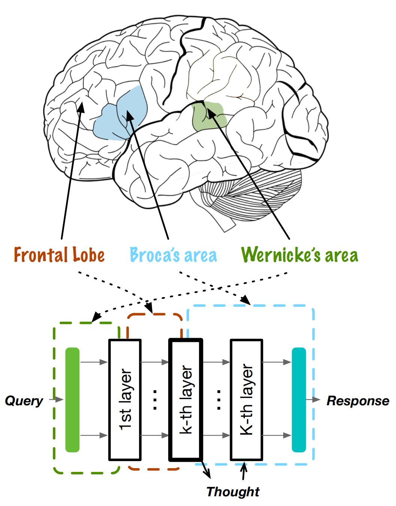
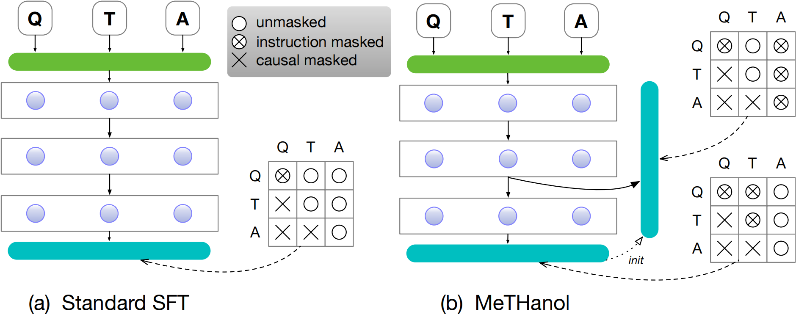
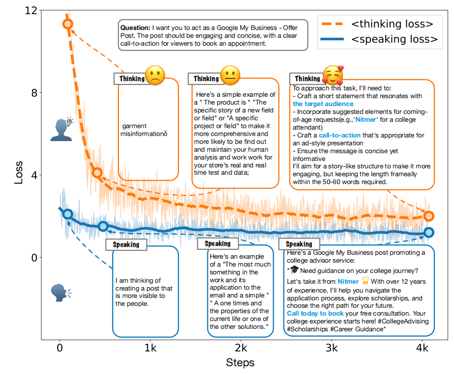
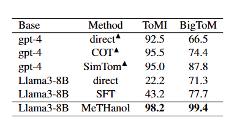
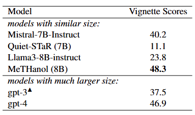

# MeTHanol

**MeTHanol: Modularized Thinking Language Models with Intermediate Layer Thinking, Decoding and Bootstrapping Reasoning**

Ningyuan Xi, Xiaoyu Wang, Yetao Wu, Teng Chen, Qingqing Gu, and Luo Ji

2025 International Joint Conference on Neural Networks (IJCNN)

- Project page: https://bachozean.github.io/methanol-page/
- Paper: https://ieeexplore.ieee.org/abstract/document/11229297
- arXiv: https://arxiv.org/abs/2409.12059
- DOI: https://doi.org/10.1109/IJCNN64981.2025.11229297

## Overview

MeTHanol studies how to strengthen the thinking and reasoning behavior of large language models from a modular perspective. Rather than treating reasoning only as a product of prompting, data-driven emergence, or additional inference-time computation, MeTHanol introduces an explicit intermediate-layer thinking pathway inside the model.

The framework selects a specific intermediate attention layer and equips it with newly implemented language heads. With annotated `(query, thought, response)` samples, the model is trained so that both the intermediate layer and the final layer can decode meaningful language tokens. At inference time, MeTHanol uses a two-pass mechanism: it first generates intermediate thoughts, then produces the final response conditioned on the reasoning process.

This design is motivated by modular views of cognition and aims to make latent reasoning more explicit, inspectable, and reusable.

## Contributions

- Proposes a modularized thinking language model that attaches language decoding capability to an intermediate transformer layer.
- Introduces dual-layer fine-tuning over annotated query, thought, and response supervision.
- Uses a two-pass inference mechanism to decode intermediate thoughts before formal answers.
- Evaluates cognitive and reasoning behavior through Theory of Mind, Sally-Anne false-belief, and Vignette-based experiments.
- Provides qualitative case studies showing planning, self-reflection, open-domain generalization, and adaptation to personalized prompts.

## Method

MeTHanol bridges latent intermediate representations and explicit natural-language reasoning. The framework encourages an intermediate layer to behave as a thinking module while preserving the final layer as the response module.



The framework is compared with standard LLM fine-tuning by adding an intermediate decoding path and training both the thought and answer generation behavior.



## Training and Evaluation

The project page reports training dynamics and benchmark results for cognitive reasoning tasks.



Fine-tuned Sally-Anne false-belief experiments and zero-shot Vignette-based experiments are used to examine whether the modular thinking mechanism improves reasoning-related behavior.





## Repository Contents

- `index.html`: static project page.
- `static/images/`: figures used by the project page and this README.
- `static/css/` and `static/js/`: page styling and template scripts.
- `.github/workflows/pages.yml`: GitHub Pages deployment workflow.

## Citation

```bibtex
@INPROCEEDINGS{11229297,
  author={Xi, Ningyuan and Wang, Xiaoyu and Wu, Yetao and Chen, Teng and Gu, Qingqing and Ji, Luo},
  booktitle={2025 International Joint Conference on Neural Networks (IJCNN)},
  title={MeTHanol: Modularized Thinking Language Models with Intermediate Layer Thinking, Decoding and Bootstrapping Reasoning},
  year={2025},
  volume={},
  number={},
  pages={1-9},
  keywords={Training;Adaptation models;Inference mechanisms;Large language models;MIMICs;Computer architecture;Oral communication;Cognition;Decoding;Methanol;modularity;LLM;latent space;reasoning},
  doi={10.1109/IJCNN64981.2025.11229297}
}
```

## Local Preview

Open `index.html` directly in a browser, or serve the repository root with any static file server:

```bash
python3 -m http.server 8765
```

## Acknowledgments

The project page is based on the Academic Project Page Template, which was adapted from the Nerfies project page.
